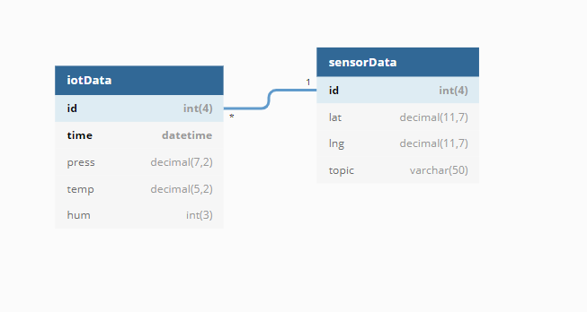

# Database Scheme

#### This database must contain the informations about sensors and the data that are collected by them

It's based on two different tables related each others using the id of the sensor

